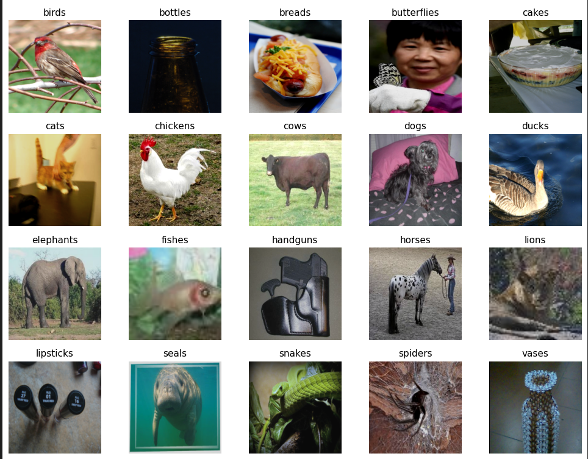
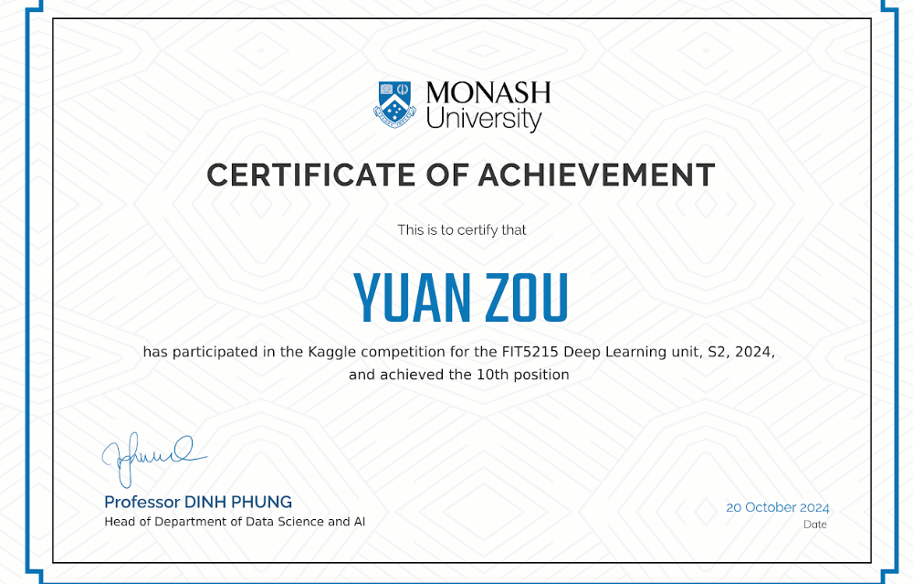
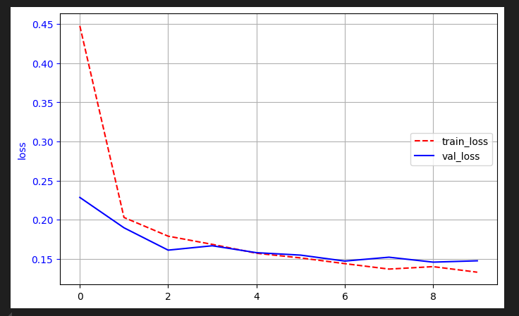

# Image Classification using SwinV2

## Overview

Image classification project for FIT5215 Deep Learning.

The model is based on SwinV2 Large pretrained on ImageNet-22K.

---

## Dataset

Animals Dataset

20 Classes

---

## Model

SwinV2 Large

Transfer Learning

Fine-tuning

---

## Results

Validation Accuracy

97.8% Accuracy

Kaggle Ranking Top 10

---

## Images

## Project Structure

...

---

## How to Run

upload to google colab, and press run all!